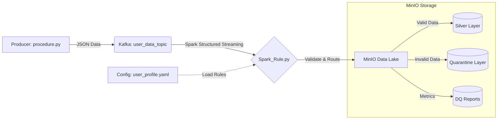

# Real-time Hybrid Data Quality Pipeline

Hệ thống xử lý và kiểm soát chất lượng dữ liệu thời gian thực (Real-time Data Quality) sử dụng kiến trúc **Medallion (Bronze/Silver/Gold)**. Hệ thống kết hợp tốc độ xử lý của **Apache Spark Structured Streaming** với tư duy quản lý chất lượng chuẩn mực của **Great Expectations**.

## Architecture (Kiến trúc hệ thống)



### Điểm nổi bật

1. **High Performance:** Sử dụng Native Spark Expressions để validate (thay vì UDF Python chậm chạp).
2. **Zero Data Loss:** Dữ liệu lỗi không bị vứt bỏ mà được đưa vào **Quarantine** để điều tra.
3. **Config-Driven:** Các luật kiểm tra (Rules) được định nghĩa trong file YAML, tách biệt hoàn toàn với Code.
4. **Reporting:** Báo cáo chi tiết từng Micro-batch và thống kê phân phối dữ liệu (Distribution Statistics).

---

## Yêu cầu hệ thống (Prerequisites)

* **Docker & Docker Compose** (Để chạy Kafka, MinIO).
* **Python 3.8+**
* **Java 8 hoặc 11** (Bắt buộc để chạy Spark).
* **RAM:** Tối thiểu 8GB (để chạy Spark Local + Docker).

---

## Cài đặt (Installation)

1. **Clone dự án:**
```bash
git clone <your-repo-url>
cd Rule-Engine

```


2. **Tạo môi trường ảo (Khuyên dùng):**
```bash
python -m venv venv
source venv/bin/activate  # Linux/Mac
# hoặc
venv\Scripts\activate     # Windows

```


3. **Cài đặt thư viện Python:**
Tạo file `requirements.txt` với nội dung sau và chạy `pip install -r requirements.txt`.
```text
pyspark==3.5.1
kafka-python
pyyaml
pandas
s3fs
pyarrow
fastparquet
duckdb
boto3
great_expectations

```


---

## Hướng dẫn chạy hệ thống (How to Run)

### Bước 1: Khởi động Hạ tầng (Infrastructure)

Chạy Docker Compose để dựng Kafka và MinIO.

```bash
docker-compose up -d

```

* Kiểm tra MinIO Console: Truy cập `http://localhost:9001` (User/Pass: `minioadmin`).
* **Lưu ý:** Đợi khoảng 30s để các service khởi động hoàn toàn.

### Bước 2: Khởi tạo Data Lake (Create Bucket)

Chạy script để tạo bucket `datalake` trên MinIO.

```bash
python bucker_minIO.py

```

* *Output mong đợi:* `Bucket 'datalake' đã tồn tại` hoặc `Đã tạo thành công`.

### Bước 3: Sinh dữ liệu giả lập (Start Producer)

Chạy script để bắn dữ liệu vào Kafka. Script này sẽ tạo ra hỗn hợp dữ liệu sạch và dữ liệu lỗi (lương âm, thiếu tuổi, sai email...).

```bash
python procedure.py

```

* Để script này chạy ở một cửa sổ Terminal riêng biệt.

### Bước 4: Chạy Spark Streaming Job (Core)

Đây là bước quan trọng nhất. Spark sẽ đọc từ Kafka, validate và ghi xuống MinIO.

```bash
python Spark_Rule.py

```

**Quan sát Log trên Terminal:**

* Bạn sẽ thấy bảng **BATCH REPORT** hiển thị trạng thái PASSED/FAILED của từng rule.
* Bạn sẽ thấy dòng log `[WRITE] Writing ... records to SILVER/QUARANTINE`.

### Bước 5: Kiểm tra kết quả (Validation)

**Cách 1: Kiểm tra nhanh bằng script Python**
Chạy tool `GX.py` để đọc file Parquet từ MinIO và hiển thị lên màn hình.

```bash
python GX.py

```

*(Lưu ý: Đảm bảo trong `GX.py` bạn trỏ đúng đường dẫn `s3://datalake/quarantine/user_profile/`)*

**Cách 2: Kiểm tra trên Giao diện MinIO**

1. Vào `http://localhost:9001`.
2. Browse Bucket `datalake`.
3. Kiểm tra 2 thư mục:
* `/silver/user_profile`: Chứa dữ liệu sạch.
* `/quarantine/user_profile`: Chứa dữ liệu lỗi kèm cột `rule_...`.


---

## Cấu hình Luật (Configuration)

Bạn có thể thay đổi luật kiểm tra mà không cần sửa code Python.
Mở file: `config/rules/user_profile.yaml`

**Ví dụ sửa luật:**

```yaml
expectations:
  # Sửa độ tuổi hợp lệ từ 0-120 thành 18-60
  - type: expect_column_values_to_be_between
    column: age
    kwargs: {min_value: 18, max_value: 60}

  # Thêm luật cấm lương âm
  - type: expect_column_values_to_be_between
    column: salary
    kwargs: {min_value: 0, max_value: 1000000}

```

*Sau khi sửa file YAML, bạn cần khởi động lại `Spark_Rule.py` để áp dụng.*

---

## Troubleshooting (Sửa lỗi thường gặp)

**1. Lỗi `S3 API Requests must be made to API port` hoặc `404 Not Found**`

* **Nguyên nhân:** Kết nối nhầm port Console (9001) hoặc sai port Docker mapping.
* **Khắc phục:** Đảm bảo trong `Spark_Rule.py` cấu hình đúng port API (thường là **9010** hoặc **9000** tùy `docker-compose.yaml`).
```python
.config("spark.hadoop.fs.s3a.endpoint", "http://localhost:9010")

```


**2. Lỗi `Missing optional dependency 'pyarrow'**`

* **Khắc phục:** `pip install pyarrow s3fs`

**3. Lỗi `Partition column process_date not found**`

* **Khắc phục:** Đảm bảo trong hàm `process_batch`, dòng `val_df = val_df.withColumn("process_date", ...)` được đặt đúng vị trí trước khi ghi file.

---

## Cấu trúc Thư mục

```text
Rule-Engine/
├── config/
│   └── rules/
│       └── user_profile.yaml  # File chứa luật kiểm tra
├── spark_apps/
│   └── Spark_Rule.py          # Code chính (Spark Streaming)
├── bucker_minIO.py            # Script tạo bucket
├── procedure.py               # Script sinh dữ liệu (Producer)
├── GX.py                      # Script xem file Parquet
├── docker-compose.yaml        # Cấu hình Docker
└── requirements.txt           # Thư viện cần thiết

```